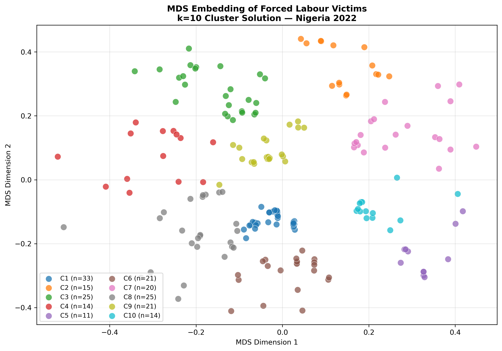
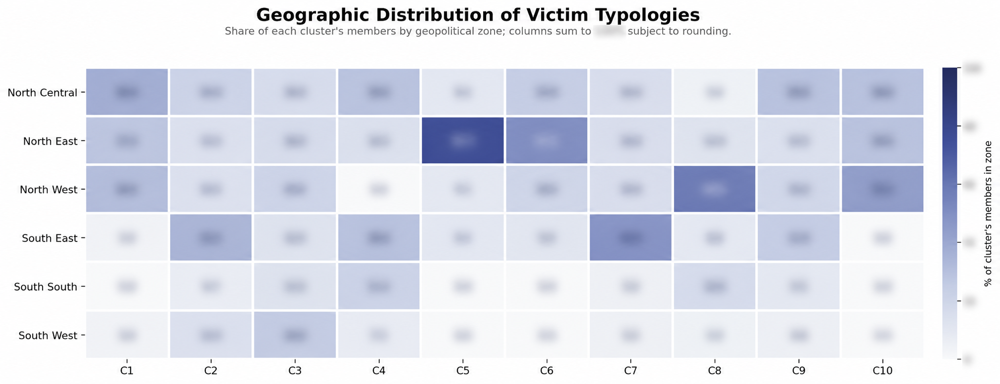
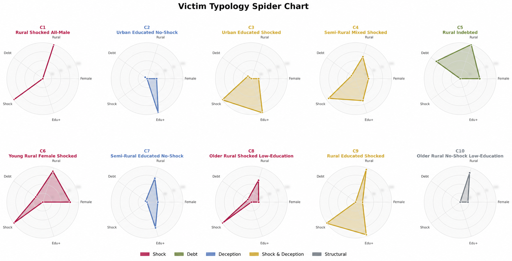
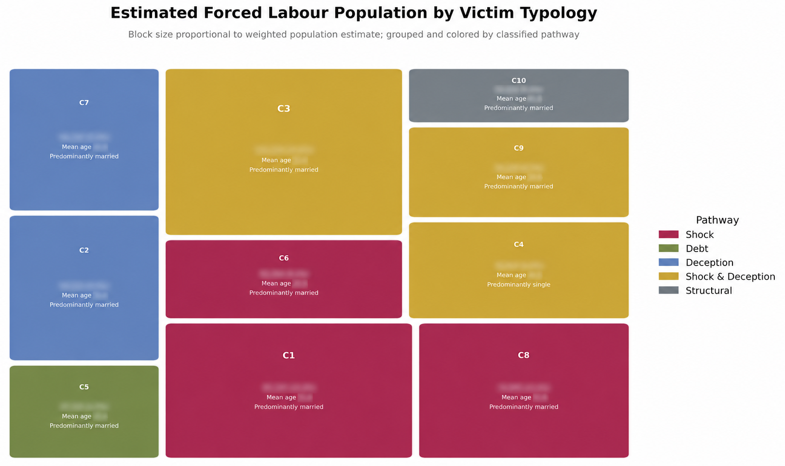
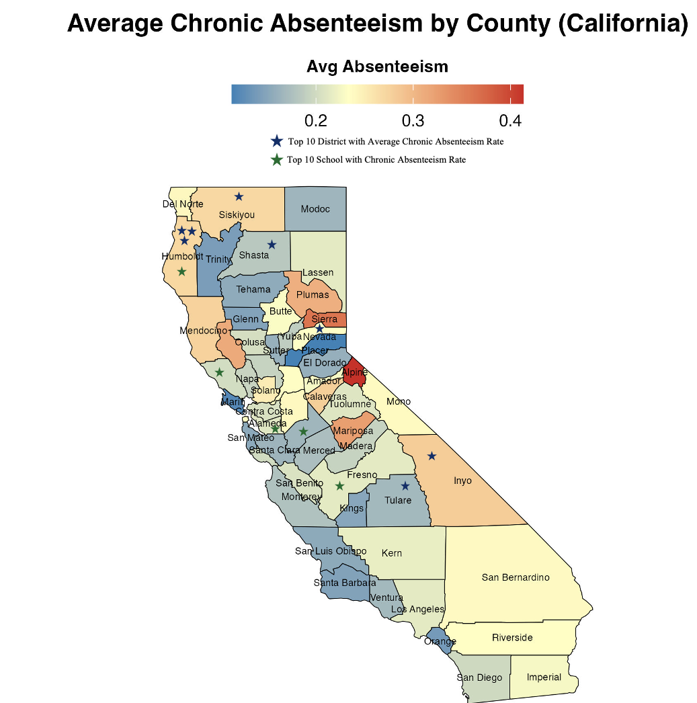
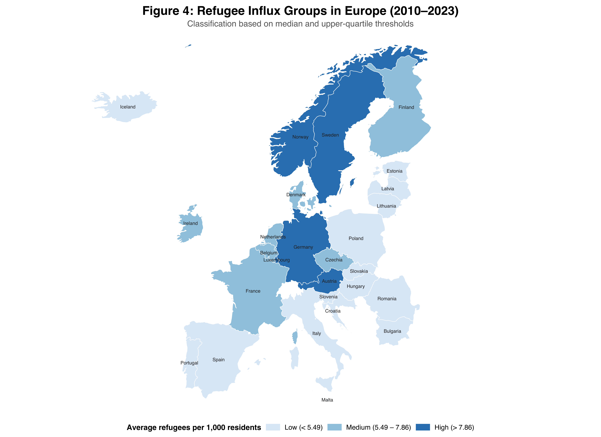
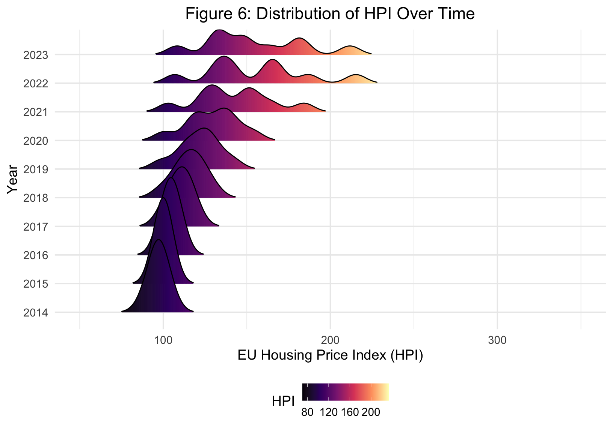
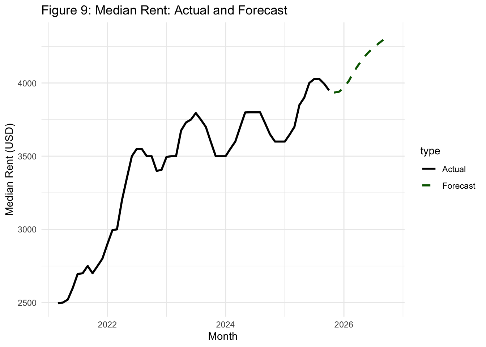

::: {.portfolio-page}

::: {.portfolio-hero}

::: {.eyebrow}
POLICY RESEARCH · DATA & EVIDENCE
:::

# Ahmed Albarqi

::: {.hero-bio}
**Ahmed Albarqi**  is a policy researcher whose work examines labour markets, social welfare, and human behaviour. He uses causal inference, applied econometrics, and computational methods to understand the drivers of inequality and evaluate the effectiveness of public policy interventions.

He holds a Master of Public Administration from Columbia University’s School of International and Public Affairs, specializing in Data Science for Policy with a minor in Social Policy. Before his graduate studies, he worked at Deloitte and the Communications, Space & Technology Commission, focusing on digital infrastructure, expanding access to technology, and promoting digital inclusion.
:::

::: {.hero-actions}
[Explore my research](#research){.btn .btn-primary}
[View CV](assets/files/Ahmed_Albarqi_CV.pdf){.btn .btn-outline-primary target="_blank"}
:::

:::

::: {.portfolio-section}

## Selected Research {#research}

::: {.section-intro}
Research on labour vulnerability, housing markets, and demographic change.
:::

::: {.project-card .featured-project}

::: {.eyebrow}
FEATURED RESEARCH
:::

### Forced Labour Vulnerability and Victim Typologies

Analysis of nationally representative survey data examining socioeconomic vulnerability and pathways into forced labour. Survey-weighted regression and propensity score matching inform the analysis of at-risk populations; clustering identifies victim typologies, with descriptive comparisons of their geographic distribution.

The full report is forthcoming from the **International Labour Organization (ILO)** and is not yet available for public sharing.

::: {.project-tags}
Survey AnalysisRegressionPSMClusteringR
:::

[View victim typologies ↓](#viz-forced-labour){.text-link}

[View geographic heatmap ↓](#viz-geographic-distribution){.text-link}

[View cluster spider charts ↓](#viz-cluster-profiles){.text-link}

[View population treemap ↓](#viz-typology-population){.text-link}

:::

::: {.projects-grid}

::: {.project-card}
### Rent Prices and Shelter Population in NYC

::: {.project-tags}
Time Series
VAR
R
:::

::: {.project-desc}
Vector autoregression analysis of the co-movement between NYC median asking rent and shelter population (monthly).
:::

::: {.project-actions}
<a class="btn btn-outline-primary" href="projects/rent_shelter_var.html">View analysis →</a>
:::
:::

::: {.project-card}
### Refugee Inflows and Housing Prices in Europe

::: {.project-tags}
Panel Data
TWFE
R
:::

::: {.project-desc}
Two-way fixed effects estimation of refugee inflows and housing prices across European countries, with spatial considerations.
:::

::: {.project-actions}
<a class="btn btn-outline-primary" href="projects/Refugees_EU.html">View analysis →</a>
:::
:::

::: {.project-card}
### Fertility Rate Forecast

::: {.project-tags}
Time Series
ARCH/GARCH
R
:::

::: {.project-desc}
Forecasting fertility rates using ARCH/GARCH volatility modeling and time-series diagnostics.
:::

::: {.project-actions}
<a class="btn btn-outline-primary" href="projects/fert_rate.html">View analysis →</a>
:::
:::

:::

:::

::: {.portfolio-section}

## Selected Visualizations {#visualizations}

::: {.section-intro}
Selected figures from my research. Click a figure to view it at full size.
:::

::: {.viz-grid}

::: {#viz-forced-labour .viz-card .featured-viz}

[{.viz-img loading="lazy"}](assets/images/visualizations/mds_embedding_k10.png){target="_blank" .viz-link}

::: {.viz-body}

### PAM Clustering: K=10 Victim Profiles (MDS Embedding)

::: {.viz-caption}
MDS embedding of PAM clustering results, identifying 10 distinct profiles across demographic and socioeconomic dimensions.
:::

::: {.viz-tags}
Clustering
Forced Labour
MDS
:::

::: {.viz-actions}
[View full figure ↗](assets/images/visualizations/mds_embedding_k10.png){.btn .btn-outline-primary target="_blank"}
:::

:::
:::

::: {#viz-geographic-distribution .viz-card .viz-wide}

[{.viz-img loading="lazy"}](assets/images/visualizations/zone_cluster_heatmap_blurred.png){target="_blank" .viz-link}

::: {.viz-body}

### Geographic Distribution of Victim Typologies

::: {.viz-caption}
Heatmap comparing the geographic distribution of victim typologies across geopolitical zones. Numerical annotations are blurred for public display.
:::

::: {.viz-tags}
GeographyForced LabourHeatmap
:::

::: {.viz-actions}
[View full figure ↗](assets/images/visualizations/zone_cluster_heatmap_blurred.png){.btn .btn-outline-primary target="_blank"}
:::

:::
:::

::: {#viz-cluster-profiles .viz-card .viz-wide}

[{.viz-img loading="lazy"}](assets/images/visualizations/radar_small_multiples_blurred.png){target="_blank" .viz-link}

::: {.viz-body}

### Victim Typology Spider Chart

::: {.viz-caption}
Spider charts comparing rural residence, gender, education, shock exposure, and indebtedness across victim profiles. Numerical scales are blurred for public display.
:::

::: {.viz-tags}
Victim ProfilesForced LabourRadar Chart
:::

::: {.viz-actions}
[View full figure ↗](assets/images/visualizations/radar_small_multiples_blurred.png){.btn .btn-outline-primary target="_blank"}
:::

:::
:::

::: {#viz-typology-population .viz-card .viz-wide}

[{.viz-img loading="lazy"}](assets/images/visualizations/treemap_blurred.png){target="_blank" .viz-link}

::: {.viz-body}

### Estimated Forced Labour Population by Victim Typology

::: {.viz-caption}
Treemap showing relative estimated population sizes across victim typologies, grouped by classified pathway. Population estimates, percentages, and mean ages are blurred for public display.
:::

::: {.viz-tags}
Victim TypologiesForced LabourTreemap
:::

::: {.viz-actions}
[View full figure ↗](assets/images/visualizations/treemap_blurred.png){.btn .btn-outline-primary target="_blank"}
:::

:::
:::

::: {.viz-card}

[{.viz-img loading="lazy"}](assets/images/visualizations/Absentiesm_by_county.png){target="_blank" .viz-link}

::: {.viz-body}

### Average Chronic Absenteeism by County (California)

::: {.viz-caption}
County-level choropleth showing absenteeism intensity and highlighted top districts/schools.
:::

::: {.viz-tags}
Spatial
Education Policy
Choropleth
:::

::: {.viz-actions}
[View full figure ↗](assets/images/visualizations/Absentiesm_by_county.png){.btn .btn-outline-primary target="_blank"}
:::

:::
:::

::: {.viz-card}

[{.viz-img loading="lazy"}](assets/images/visualizations/Europe_Refugees.png){target="_blank" .viz-link}

::: {.viz-body}

### Refugee Influx Groups in Europe (2010–2023)

::: {.viz-caption}
Classification based on median and upper-quartile thresholds (refugees per 1,000 residents).
:::

::: {.viz-tags}
Spatial
Migration
Choropleth
:::

::: {.viz-actions}
[View full figure ↗](assets/images/visualizations/Europe_Refugees.png){.btn .btn-outline-primary target="_blank"}
:::

:::
:::

::: {.viz-card}

[{.viz-img loading="lazy"}](assets/images/visualizations/Housing_Prices_Distribution_Overtime.png){target="_blank" .viz-link}

::: {.viz-body}

### Distribution of EU Housing Price Index Over Time

::: {.viz-caption}
Ridgeline distributions showing the shift in HPI across years.
:::

::: {.viz-tags}
Housing
Distribution
:::

::: {.viz-actions}
[View full figure ↗](assets/images/visualizations/Housing_Prices_Distribution_Overtime.png){.btn .btn-outline-primary target="_blank"}
:::

:::
:::

::: {.viz-card}

[{.viz-img loading="lazy"}](assets/images/visualizations/forecast_of_rent.png){target="_blank" .viz-link}

::: {.viz-body}

### Median Rent: Actual and Forecast

::: {.viz-caption}
Observed median rent with forecast extension (dashed).
:::

::: {.viz-tags}
VAR
Time Series
:::

::: {.viz-actions}
[View full figure ↗](assets/images/visualizations/forecast_of_rent.png){.btn .btn-outline-primary target="_blank"}
:::

:::
:::

:::

:::

::: {.portfolio-section .contact-section}

## Get in Touch {#contact}

Connect with me or explore my work and writing.

::: {.contact-links}
[Email ↗](mailto:asbarqi@gmail.com)
[LinkedIn ↗](https://www.linkedin.com/in/asbarqi/){target="_blank"}
[Substack ↗](https://substack.com/@ahmedincontext){target="_blank"}
:::

:::

::: {.portfolio-footer}
Ahmed Albarqi · Policy Research & Quantitative Analysis
:::

:::
