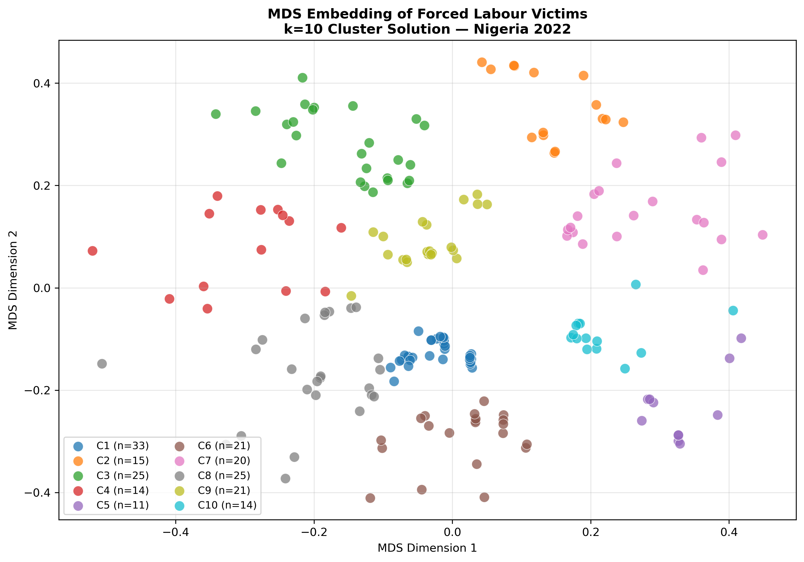
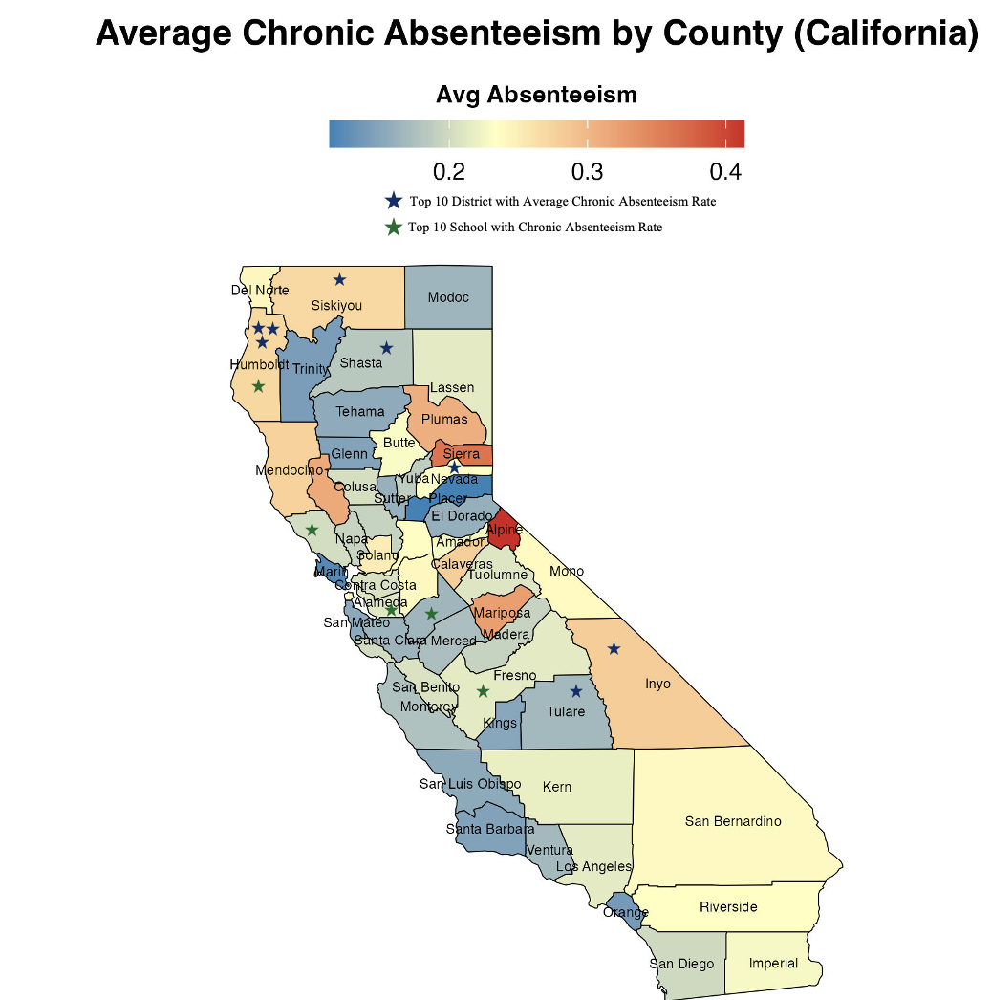

Effective policy research depends on clear and interpretable data visualization. Below are selected figures from my work, spanning spatial analysis, time-series modeling, clustering and comparative policy insights.

---

::: {.viz-grid}

::: {.viz-card}

[{.viz-img}](assets/images/visualizations/mds_embedding_k10.png){target="_blank" .viz-link}

::: {.viz-body}

### PAM Clustering: K=10 Victim Profiles (MDS Embedding)

::: {.viz-caption}
MDS embedding of PAM clustering results using Gower distance, identifying 10 distinct forced labour victim profiles across demographic and socioeconomic dimensions.
:::

::: {.viz-tags}
Clustering
Forced Labour
MDS
:::

::: {.viz-actions}
[Open](assets/images/visualizations/mds_embedding_k10.png){.btn .btn-outline-primary target="_blank"}
:::

:::
:::

::: {.viz-card}

[{.viz-img}](assets/images/visualizations/Absentiesm_by_county.png){target="_blank" .viz-link}

::: {.viz-body}

### Average Chronic Absenteeism by County (California)

::: {.viz-caption}
County-level choropleth showing absenteeism intensity and highlighted top districts/schools.
:::

::: {.viz-tags}
Spatial
Education Policy
choropleth
:::

::: {.viz-actions}
[Open](assets/images/visualizations/Absentiesm_by_county.png){.btn .btn-outline-primary target="_blank"}
:::

:::
:::

:::